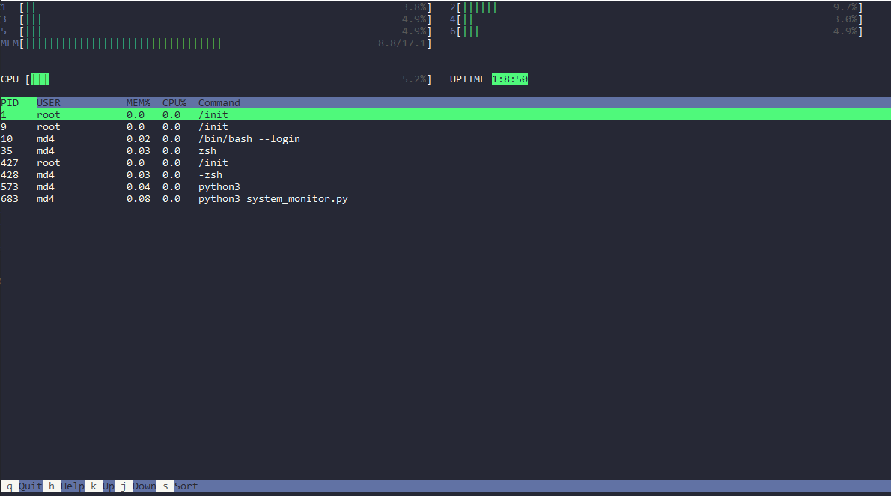

> A Cross Platform System Monitor for the Command Line 

This is a cross platform system monitor using [psutil](https://github.com/giampaolo/psutil/) for system information and curses for output.

For a better monitoring tool, I recommend [glances](https://github.com/nicolargo/glances)

## Installation

``` bash 
git clone https://github.com/ncarn2/system_monitor.git
cd system_monitor  
pip install .
python3 system_monitor.py
```

## Usage

`python3 system_monitor.py` in the local directory assuming you have all of the dependencies installed. 

## Example



## Known Issues
- Does not work great with Windows.
- Resizing usually crashes. 
- CPU, MEM, and COMMAND sorting are not implemented. 

## License

[](http://badges.mit-license.org)
